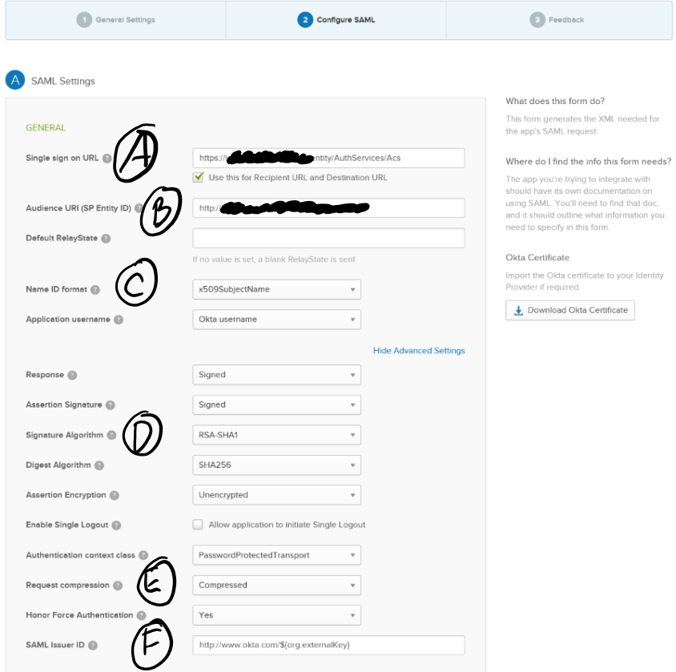

Using AuthServices with IdentityServer3 and Okta
=============
Kentor AuthServices can be used very effectively to extend the functionality 
of IdentityServer3 by adding support for SAML-based identity providers, such 
as Okta and OneLogin.  This example will show how to add Okta as an identity
provider to IdentityServer3 using the Kentor AuthServices package. 

## Step 0 - Establish your own identity server using IdentityServer3
This article assumes that you already have your own identity server project set
up and that it uses IdentityServer3.  If you haven't, check out the documentation
and samples for that project and then come back here when you have a working 
identity server.

## Step 1 - Add the NuGet package to your identity server
The package you need is ```Kentor.AuthServices.Owin```.  Install that to the
project where you have IdentityServer3 established.  After you do this, you also
need to add a new (empty) section to the web.config file. 

First, register the section at the top of the web.config file:
```xml
<configSections>
  <section name="System.identityModel" type="System.IdentityModel.Configuration.SystemIdentityModelSection, System.IdentityModel, Version=4.0.0.0, Culture=neutral, PublicKeyToken=B77A5C561934E089" />
</configSections>
```
Then add the required empty section:
```xml
<System.identityModel/>
```

We'll add the necessary configuration to establish the Okta identity provider in 
identity server later, after we've set up the application within Okta.

## Step 2 - Configure an Application within Okta
If you don't already have an instance of Okta (or don't have access to one with admin /
configuration privileges), you can create a developer instance.  Ultimately, you will 
want to add an "Application" to this instance.  Add one, and give it some kind of name, 
and you will get to the important part of configuring the application.  I've included a 
screenshot below with its "Show Advanced Settings" selected, and highlighted the 6 important 
parts of the configuration.  I'll explain each one in turn.



Item | Explanation
---| ---
Single sign-on URL (A) | This is the Assertion Consumer Service (ACS) endpoint within the application.  In our case, this is the core endpoint of the app, plus “/AuthServices/Acs”.  So if your Identity Server is at https://id.local/identity, then your value here would be “https://id.local/identity/AuthServices/Acs”.
Audience URI (B) | This should be the metadata URL of the audience (in this case, your identity server's SAML metadata), so use the ACS endpoint minus the ACS.  Carrying forward the example, this would be https://id.local/identity/AuthServices.
Name ID Format (C) | This will be the Okta username for any of your users.  I chose the X509SubjectName with Okta UserName.  I’m assuming that you’ve probably got some kind of custom user service within Identity Server to get your own claims – or even if you don’t, you have the “Users” object defined with some hard coded users or something.  What you need to be able to do is determine YOUR username from something that Okta can pass back to you for THEIR username.  Choose from the available options, knowing that you may need to translate it a bit to get to your username.
Signature Algorithm (D) | Change this to RSA-SHA1.  If you don't, you'll get an exception from AuthServices telling you to add a line like ```Options.GlobalEnableSha256XmlSignatures();``` which will fix *that* problem but create another downstream one in IdentityServer3 when it goes to sign its tokens.  Using RSA-SHA1 avoids that issue.
Request Compression (E) | Change this to Compressed.  If you don't, you'll get a "Bad Request" error from within Okta.  Working with their support team provided this resolution.
SAML Issuer ID (F) | This has a default value of http://www.okta.com/${org.externalKey} and ${org.externalKey} is the application id that Okta creates for you.  I left this alone, which means that the Issuer ID will be in the form http://www.okta.com/<appid>.  You can see what your app id is by saving your configuration, and then choosing the “View Setup Instructions” option and reviewing the Identity Provider Issuer value.  We will need that later.

## Step 3 - Configure your identity server with the new identity provider

Most of what you need to do is pretty easily seen by just looking at the code below along with the comments
that simply refer back to the Okta configuration points in Step 2.

*Metadata*: You will need to provide the "metadata URL" in the code below.  To get this, you can look at the "Sign On"
tab within the Okta application configuration area, and right-click the "Identity Provider metadata" link and copy the URL.

```csharp
public class Startup
    {
        public void Configuration(IAppBuilder app)
        {
            var options = Helpers.GetIdentityServerOptions(); // this is just a helper function where we specify our IdSrv3 options
            options.AuthenticationOptions = new AuthenticationOptions
            {
                IdentityProviders = ConfigureIdentityProviders
            };

            app.UseCookieAuthentication(new CookieAuthenticationOptions());
            app.SetDefaultSignInAsAuthenticationType(CookieAuthenticationDefaults.AuthenticationType);
            app.Map("/identity", idsrvApp =>
            {
                idsrvApp.UseIdentityServer(options);
            });
        }

        public static void ConfigureIdentityProviders(IAppBuilder app, string signInAsType)
        {                  
            var authServicesOptions = new KentorAuthServicesAuthenticationOptions(false)
            {
                SPOptions = new SPOptions
                {
                    EntityId = new EntityId("<okta Audience URI>") // from (B) above
                },
                SignInAsAuthenticationType = signInAsType,
                AuthenticationType = "okta", // this is the "idp" - identity provider - that you can refer to throughout identity server
                Caption = "Okta",  // this is the caption for the button or option that a user might see to prompt them for this login option             
            };
            
            authServicesOptions.IdentityProviders.Add(new IdentityProvider(
                new EntityId("<OktaIssuerUri>"), authServicesOptions.SPOptions)  // from (F) above
            {
                LoadMetadata = true,
                MetadataUrl = new Uri("https://<OktaInstance>/app/<OktaAppId>/sso/saml/metadata") // see Metadata note above
            });
            
            app.UseKentorAuthServicesAuthentication(authServicesOptions);            
        }
    }
```	

## Step 4 - Try it out!  
Logging in with Okta through your identity server should work at this point.  Cheers!

## Step 5 - Set up IdP-Initiated support 
This is an optional but very nice and (I think) important step that will enable Okta users
to login to your site by clicking on the "app" icon on their Okta Dashboard.  The process
involves setting up the Kentor options to "allow unsolicited response", setting up a
redirect page on your target site (not identity server), and specifying that in the Kentor
settings.  Explanations follow.

The first step is to configure the AuthServices/Acs endpoint to allow for unsolicited responses.
To do this, modify the code snippet where you are adding IdentityProviders to include the 
AllowUnsolictedAuthnResponse = true line shown below.

```csharp
			authServicesOptions.IdentityProviders.Add(new IdentityProvider(
                new EntityId(oktaEntityId), authServicesOptions.SPOptions)
            {
                LoadMetadata = true,
                MetadataUrl = new Uri(oktaMetadataUrl),
                AllowUnsolicitedAuthnResponse = true
            });
```

Now you need to set up your target website (not IdentityServer3) to have a page that will
simply turn around and redirect to your identity server with an authorize request.

I set up a new page in my webforms site call "IdP_InitiatedRedirect" and required an "idp" query 
string value in case I want to use other SAML IdP's. Then in the SPOptions setup, you add the URL 
for the "ReturnUrl" property as shown below:

```chsarp
				SPOptions = new SPOptions
                {
                    EntityId = new EntityId(serviceProviderEntityId),
                    ReturnUrl = new Uri("https://yoursite.com/Idp_InitiatedRedirect.aspx?idp=okta")
                }, 
```

The only thing left is to code the logic on your redirect page to make an authorize request
to your identity server.  You should already have a reference to the IdentityModel.Client package,
so then you can write some code that looks like this:

```csharp
		protected void Page_Load(object sender, EventArgs e)
        {
            var idp = Request.QueryString["idp"];
            if (string.IsNullOrEmpty(idp))
                throw new Exception("No idp included in redirect querystring!!");

            var scopesForAuth = "<the scopes for your application>";
            var state = Guid.NewGuid().ToString("N");
            var nonce = Guid.NewGuid().ToString("N");
            var client = new OAuth2Client(new Uri("https://<youridentityserver>" + "/connect/authorize"));

            var returnUrlForOkta = client.CreateAuthorizeUrl("<youridserverclientid", "id_token token", scopesForAuth, 
                "https://yoursite.com/yourreallogintarget"), 
                state, nonce, acrValues: string.Format("idp:{0}", idp), responseMode: "form_post");

            Response.Redirect(returnUrlForOkta, false);
        }
```
Once you have all of that in place, you should be able to click the app button on the 
Okta dashboard and successfully log in to your website through IdentityServer3!