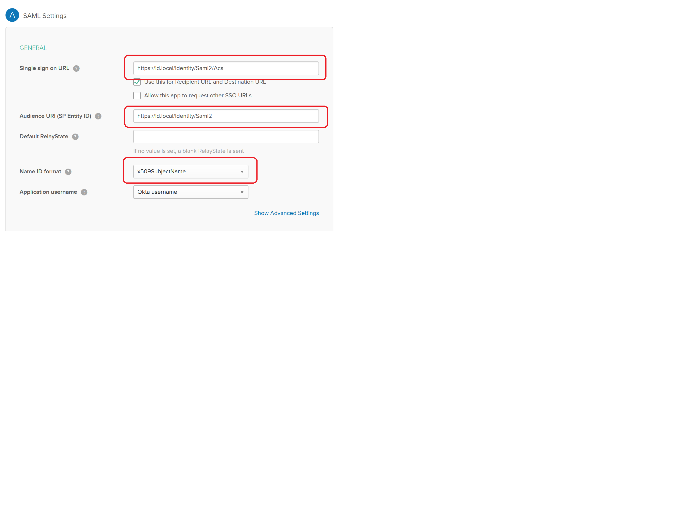
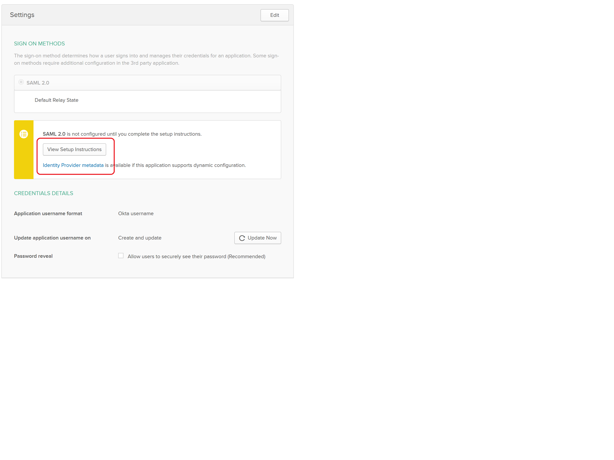

IdentityServer3 with Okta
=========================
Sustainsys Saml2 can be used very effectively to extend the functionality of IdentityServer3 by adding support 
for SAML-based identity providers, such as Okta and OneLogin. This example will show how to add Okta as an 
identity provider to IdentityServer3 using the Sustainsys Saml2 package.

Step 0: Establish identity server using IdentityServer3
-------------------------------------------------------
This article assumes that you already have your own identity server project set up and that it uses 
IdentityServer3. If you haven't, check out the documentation and samples for that project and then come back here 
when you have a working identity server.

Step 1: Add the NuGet package to your identity server
------------------------------------------------------
The package you need is ``Sustainsys.Saml2.Owin``. Install that to the project where you have IdentityServer3 established.
We'll add the necessary configuration to establish the Okta identity provider in identity server later, after we've 
set up the application within Okta.

Step 2: Configure an Application within Okta
---------------------------------------------
If you don't already have an instance of Okta (or don't have access to one with admin / configuration privileges), you 
can create a developer instance. Ultimately, you will want to add an "Application" to this instance. Add one, and 
give it some kind of name, and you will get to the important part of configuring the application. Below is the SAML
settings screen and a description of how to specify these options.

.. list-table:: 
    :widths: 30 70
    :header-rows: 1
    :class: tight-table

    * - Item
      - Explanation
    * - Single Sign-On URL
      - This is the *Assertion Consumer Service (ACS)* endpoint within the application. In our case, this is the core endpoint 
        of the app, plus ``/Saml2/Acs``. So if your Identity Server is at ``https://id.local/identity``, then your value here would 
        be ``https://id.local/identity/Saml2/Acs``.
    * - Audience URI
      - This should be the metadata URL of the audience (in this case, your identity server's SAML metadata), so use the 
        ACS endpoint minus the ACS. Carrying forward the example, this would be ``https://id.local/identity/Saml2``.
    * - Name ID Format
      - This will be the Okta username for any of your users. I chose the ``X509SubjectName`` with Okta UserName. I’m 
        assuming that you’ve probably got some kind of custom user service within Identity Server to get your own 
        claims – or even if you don’t, you have the “Users” object defined with some hard coded users or something. What 
        you need to be able to do is determine YOUR username from something that Okta can pass back to you 
        for THEIR username. Choose from the available options, knowing that you may need to translate it a bit to get 
        to your username.

Step 3: Configure your identity server with the new identity provider
---------------------------------------------------------------------
Most of what you need to do is pretty easily seen by just looking at the code below along with the comments 
that simply refer back to the Okta configuration points in Step 2.

**Metadata**: You will need to provide the "metadata URL" in the code below. To get this, you can look at 
the "Sign On" tab within the Okta application configuration area, and right-click the "Identity Provider metadata" link 
and copy the URL.

**Entity ID**: You can determine this by clicking the View Setup Instructions button and looking for 
the "Identity Provider Issuer" value. 

.. code-block:: csharp 

    public class Startup
    {
        public void Configuration(IAppBuilder app)
        {
            var options = Helpers.GetIdentityServerOptions(); // a helper function where we specify our IdSrv3 options
            options.AuthenticationOptions = new AuthenticationOptions
            {
                IdentityProviders = ConfigureIdentityProviders
            };

            app.UseCookieAuthentication(new CookieAuthenticationOptions());
            app.SetDefaultSignInAsAuthenticationType(CookieAuthenticationDefaults.AuthenticationType);
            app.Map("/identity", idsrvApp =>
            {
                idsrvApp.UseIdentityServer(options);
            });
        }

        public static void ConfigureIdentityProviders(IAppBuilder app, string signInAsType)
        {                  
            var saml2Options = new Saml2AuthenticationOptions(false)
            {
                SPOptions = new SPOptions
                {
                    AuthenticateRequestSigningBehavior = SigningBehavior.Never // or add a signing certificate
                    EntityId = new EntityId("<okta Audience URI>") // from (B) above
                },
                SignInAsAuthenticationType = signInAsType,
                AuthenticationType = "okta", // the "idp" - identity provider - that you can refer to throughout identity server
                Caption = "Okta",  // the caption for the button or option that a user might see to prompt them for this login option             
            };
            
            saml2Options.IdentityProviders.Add(new IdentityProvider(
                new EntityId("<OktaIssuerUri>"), saml2Options.SPOptions)  // from (F) above
                {
                    LoadMetadata = true,
                    MetadataLocation = "https://<OktaInstance>/app/<OktaAppId>/sso/saml/metadata" // see Metadata note above
                });
            
            app.UseSaml2Authentication(saml2Options);            
        }
    }

.. note::
    Regarding the "AuthenticateRequestSigningBehavior" above: Okta sets a value in their metadata that specifies 
    ``WantAuthnRequestsSigned="true"``, which means that Saml2 will try to sign outgoing AuthN requests. The code above 
    does work -- the "Want" doesn't imply "Require". To actually honor the request, though and enable signing, you need 
    to go a step further:

    To enable signing, call ``saml2Options.ServiceCertificates.Add(new ServiceCertificate { ... })`` to configure the 
    certificate Saml2 should use for signing. That certificate should be something that you have generated on your 
    end, where you have a private key. If you don't have that already, I'd suggest going with the 
    ``SigningBehavior.Never`` option.

Step 4: Try it out!
-------------------
Logging in with Okta through your identity server should work at this point. Cheers!

Step 5: Set up IdP-Initiated support
------------------------------------
This is an optional but very nice and (I think) important step that will enable Okta users to login to your 
site by clicking on the "app" icon on their Okta Dashboard. The process involves setting up the Sustainsys options 
to "allow unsolicited response", setting up a redirect page on your target site (not identity server), and specifying 
that in the Sustainsys settings. Explanations follow.

The first step is to configure the Saml2/Acs endpoint to allow for unsolicited responses. To do this, modify 
the code snippet where you are adding IdentityProviders to include the ``AllowUnsolictedAuthnResponse = true`` line 
shown below.

.. code-block:: csharp

    saml2Options.IdentityProviders.Add(new IdentityProvider(
        new EntityId(oktaEntityId), Ssml2Options.SPOptions)
        {
            LoadMetadata = true,
            MetadataLocation = oktaMetadataUrl,
            AllowUnsolicitedAuthnResponse = true
        });

Now you need to set up your target website (not IdentityServer3) to have a page that will simply turn around and 
redirect to your identity server with an authorize request.

I set up a new page in my webforms site call "IdP_InitiatedRedirect" and required an "idp" query string value in 
case I want to use other SAML IdP's. Then in the ``SPOptions`` setup, you add the URL for the ``ReturnUrl`` property 
as shown below:

.. code-block:: csharp

    SPOptions = new SPOptions
    {
        EntityId = new EntityId(serviceProviderEntityId),
        ReturnUrl = new Uri("https://yoursite.com/Idp_InitiatedRedirect.aspx?idp=okta")
    }, 

The only thing left is to code the logic on your redirect page to make an authorize request to your 
identity server. You should already have a reference to the ``IdentityModel.Client`` package, so then you can 
write some code that looks like this:

.. code-block:: csharp

    protected void Page_Load(object sender, EventArgs e)
    {
        var idp = Request.QueryString["idp"];
        if (string.IsNullOrEmpty(idp))
            throw new Exception("No idp included in redirect querystring!!");

        var scopesForAuth = "<the scopes for your application>";
        var state = Guid.NewGuid().ToString("N");
        var nonce = Guid.NewGuid().ToString("N");
        var client = new OAuth2Client(new Uri("https://<youridentityserver>" + "/connect/authorize"));

        var returnUrlForOkta = client.CreateAuthorizeUrl("<youridserverclientid", "id_token token", scopesForAuth, 
            "https://yoursite.com/yourreallogintarget"), 
            state, nonce, acrValues: string.Format("idp:{0}", idp), responseMode: "form_post");

        Response.Redirect(returnUrlForOkta, false);
    }

Once you have all of that in place, you should be able to click the app button on the Okta dashboard and successfully 
log in to your website through IdentityServer3!

Step 6 - Enable multiple Okta instances (multi-tenant / multiple independent Okta IdPs)
---------------------------------------------------------------------------------------
If you only have a single Okta instance to enable, you don't need to perform this step. But often, implementations of 
IdSrv3 find themselves wanting to provide SSO services to multiple Okta instances. Doing this tweaks our approach 
a little, so read on...

By way of background, when an AuthN request comes in to the IdentityServer3/Sustainsys pipeline, the package middleware 
needs to determine where to forward the request -- this amounts to an EXACT URL -- which is not only different 
for each Okta client, but also different for each application within Okta. And this logic needs to be applied for 
both standard AuthN requests from your website, AND for the IdP-Initiated Redirect process described above.

Whether the above fully makes sense to you or not, the net effect is that you really should be setting up new 
instances of the Saml2 middleware for each Okta tenant you have. This approach led me to a little refactoring of the 
above code -- other appproaches are definitely valid, but shown below is some code that works.

There is both Okta configuration that needs to be done for each instance of Okta, and then a follow-up set of 
config within your IdentityServer that will need to be done.  The basic steps in the process for setting up each 
instance (including editing your single instance) are as follows:

* Identify the idpName and description you will use for the instance in question
* Configure the app within Okta with the single-sign-on URL based on the instance name and the other Okta config options laid out in step 2 above
* Get the entity id and metadata URL that were generated by the Okta configuration step above
* Configure a new instance of Saml2 middleware within IdSrv3 based on all of the above info

Identify the idpName and Description for an Okta App instance
+++++++++++++++++++++++++++++++++++++++++++++++++++++++++++++
For this, just consider your instance and make up two values that make sense. By way of example, to be "Okta Verified", 
you need to support their "Okta Application Network" testing instance. To set up an IdP name and description for 
this, I just chose "okta-oan" for the idp name, and "Okta-OAN" for the description. It could be 
anything -- it just needs to be unique to that instance within your setup. We'll see in both the Okta and 
middleware configuration how this is important.

Configure the Okta App with Single-Sign-On URL based on Instance Name
+++++++++++++++++++++++++++++++++++++++++++++++++++++++++++++++++++++
All of the Okta configuration options in Step 2 above are still valid - with the one exception being the 
Single Sign On URL. This is because there is no longer a single "Saml2" endpoint within your identity server -- there 
will be multiple: one for each Okta instance you have.

So this value will use the idpName you came up with in the previous step. The idpname replaces "Saml2" from version 1 
of this configruation: ``https://id.local/identity/{idpName}/Acs``. If we continue our example 
of ``okta-oan`` as an idp name, we would have: ``https://id.local/identity/okta-oan/Acs``.

Get the EntityId and Metadata URL from Okta
+++++++++++++++++++++++++++++++++++++++++++
This will be the same way you got the entity id and metadata URL from Step 2 above, but may involve you requesting it 
from an Okta administrator of the instance you are trying to set up. The values look something like this:

* entity id: http://www.okta.com/exk4yxtgy7ZzSDp8e0h7
* metadata URL: https://dev-490944.oktapreview.com/app/exk4yxtgy7ZzSDp8e0h7/sso/saml/metadata

Note that even though the entity id does NOT refer to the okta instance you are setting up, the app id 
inside it (exk...) is unique to the okta instance, so the entity id will indeed be different for each instance.

Configure a new instance of Saml2 middleware within IdSrv3
++++++++++++++++++++++++++++++++++++++++++++++++++++++++++
The 4 basic code components in the approach are (feel free to edit -- but at least you can see the approach):

* a ``GetOkta{instance}Options`` method for each instance (where you place the configuration unique to each instance)
* a single ``GetOktaIdentityProvider`` method (configures entity id and metadata url based on inputs)
* a single ``GetCoreOktaOptions`` method (sets up the options common to each instance, and sets the module path based on input param)
* an ``app.UseSaml2Authentication()`` call for each of your supported Okta instances (make sure you actually add the instance to the pipeline)

The following code I put in a static class called ``Helpers-Okta`` and shows the first three code components above:

.. code-block:: csharp

    internal static Saml2AuthenticationOptions GetOktaOanOptions(string signInAsType)
    {
        var saml2Options = GetCoreOktaOptions(signInAsType, "okta-oan", "Okta-OAN");

        const string oktaEntityId = "http://www.okta.com/exk16268xbsV0A213sa23";  // got this from an Okta OAN support / admin
        const string oktaMetadataUrl = "https://okta-coe-test.okta.com/app/exk16268xbsV0A213sa23/sso/saml/metadata";  // got this from an Okta OAN support / admin

        var oanInstance = GetOktaIdentityProvider(saml2Options.SPOptions, oktaEntityId, oktaMetadataUrl);
        saml2Options.IdentityProviders.Add(oanInstance);

        return saml2Options;
    }

    private static Saml2AuthenticationOptions GetCoreOktaOptions(string signInAsType, string idpName, string idpLabel)
    {
        string serviceProviderEntityId;
        string oktaRelyingPartyRedirectUrl;

        switch (GetEnvironment())  // determine if you are in dev, test, or production here....
        {
            case "PRD":
                serviceProviderEntityId = "https://{productionIdentityServerRoot}/identity/saml";
                oktaRelyingPartyRedirectUrl = string.Format("https://{productionAppWebSiteRoot}/Portal/Pages/IdP_InitiatedRedirect.aspx?idp={0}", idpName);
                break;
            case "TEST":
                serviceProviderEntityId = "https://{testIdentityServerRoot}/identity/saml";
                oktaRelyingPartyRedirectUrl = string.Format("https://{testAppWebSiteRoot}/Portal/Pages/IdP_InitiatedRedirect.aspx?idp={0}", idpName);
                break;
            default:
                serviceProviderEntityId = "https://{devIdentityServerRoot}/identity/saml";
                oktaRelyingPartyRedirectUrl = string.Format("https://{devAppWebSiteRoot}/Portal/Pages/IdP_InitiatedRedirect.aspx?idp={0}", idpName);
                break;
        }

        var saml2Options = new Saml2AuthenticationOptions(false)
        {
            SPOptions = new SPOptions
            {
                EntityId = new EntityId(serviceProviderEntityId),
                ReturnUrl = new Uri(oktaRelyingPartyRedirectUrl),
                ModulePath = string.Format("/{0}", idpName)   // this is important -- it is what drives the separate instances
            },
            SignInAsAuthenticationType = signInAsType,
            AuthenticationType = idpName,
            Caption = idpLabel,
        };            

        return saml2Options;
    }

    private static IdentityProvider GetOktaIdentityProvider(ISPOptions options, string oktaEntityId, string oktaMetadataUrl)
    {            
        var idp = new IdentityProvider(new EntityId(oktaEntityId), options)
        {
            LoadMetadata = true,
            MetadataLocation = oktaMetadataUrl,
            AllowUnsolicitedAuthnResponse = true
        };
        return idp;
    }

For the ``Startup`` code, it becomes pretty simple to add the instances:

.. code-block:: csharp

    // Okta Application Network (OAN) instance            
    app.UseSaml2Authentication(Helpers.GetOktaOanOptions(signInAsType));

The code above just calls our new method for the instance we have configured.

Now it should all work and is repeatable for other instances!

.. note::

    The above approach does require code changes for each new instance of Okta you want to add / configure. If you wanted, 
    you could pretty easily put the configuration into a database table and read it that way -- the four data points you 
    need for each instance are:

    * idp Name
    * idp Description
    * entity Id
    * metadata URL
    
    You could create a table with those entries, then read them and loop through each, creating an instance for 
    them. Note also that making changes to this would likely require at least restarting the application pool for 
    your identity server or something similar to force the running instance to recognize the new configuration.